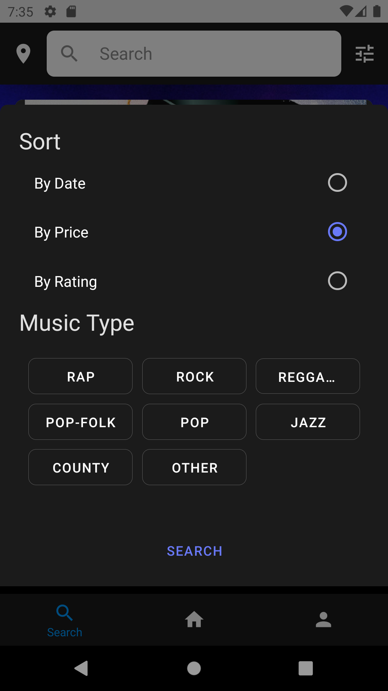
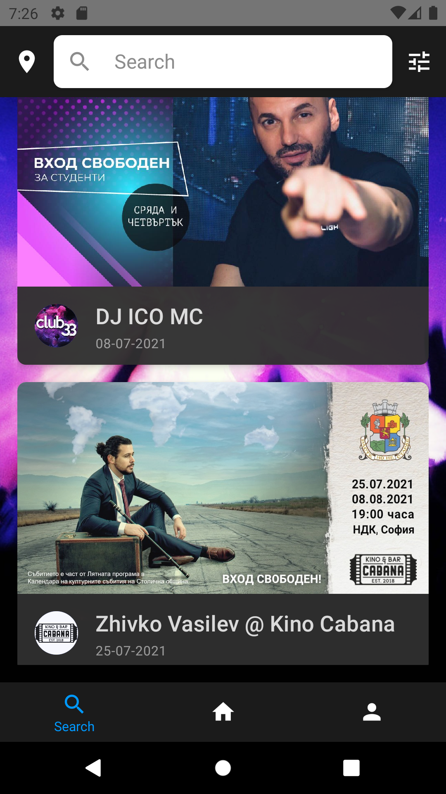
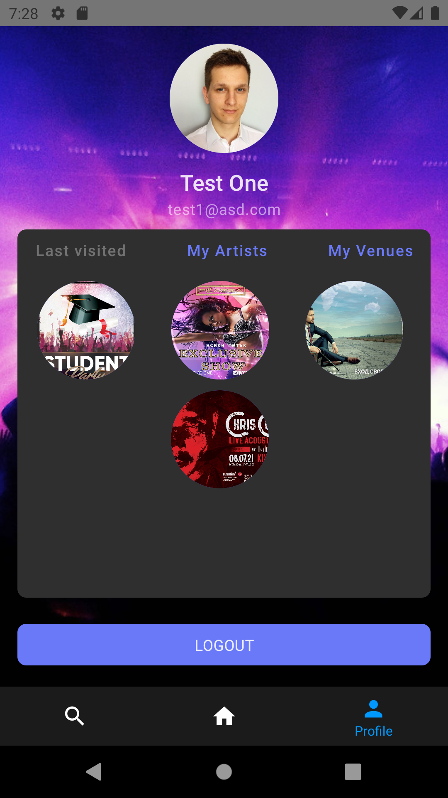
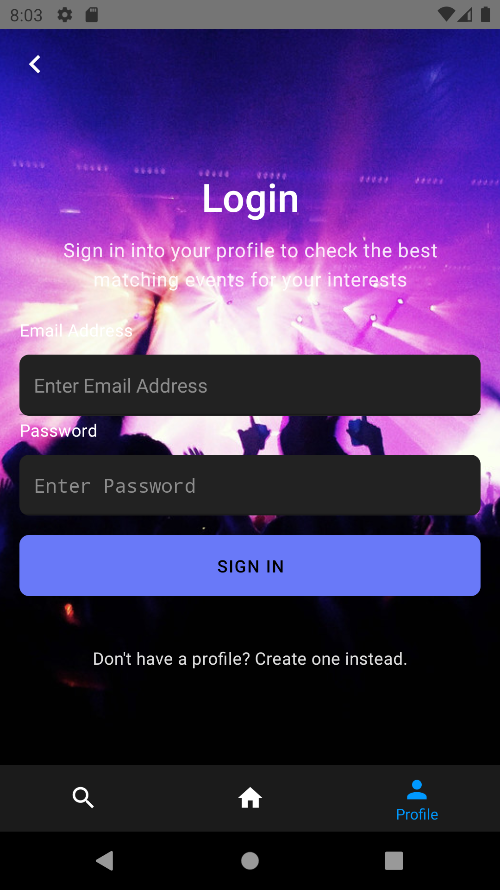

# NightLife application prototype

This is an initial version of the NightLife mobile application. The idea behind the project is to create a mobile application that gathers information about all musical venues, artists and events to present to the wider audience.

Users should be able to:

- Create a profile
- Login in their profile
- Search, filter and sort events

Venue mangers should be able to:

- Setup a profile
- Upload information about events

# How it looks

## Search

| **Refine results**                                  | **Search results**                                 |
| --------------------------------------------------- | -------------------------------------------------- |
|  |  |

## Events

| **Event details**                                      | **Add event form**                             |
| ------------------------------------------------------ | ---------------------------------------------- |
|  |  |

## Profile

| **Registered user**                        | **Login screen**                                |
| ------------------------------------------ | ----------------------------------------------- |
|  |  |
