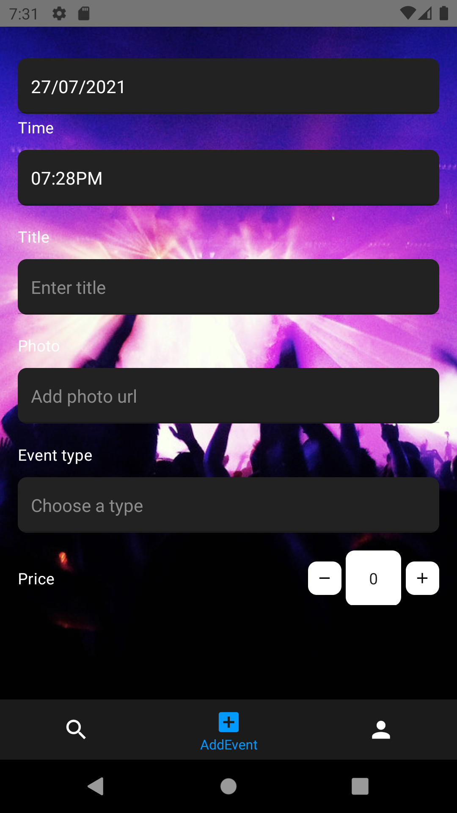

# NightLife application prototype

This is the prototype of the NightLife mobile application. The idea behind the project is to create a mobile application that gathers information about all musical venues, artists and events to present to the wider audience.

## Functionalities

### Users should be able to:

- Create a profile
- Login in their profile
- Search, filter and sort events

### Venue mangers should be able to:

- Setup a profile
- Upload information about events

# How it looks

## Search

## Events

## Profile

